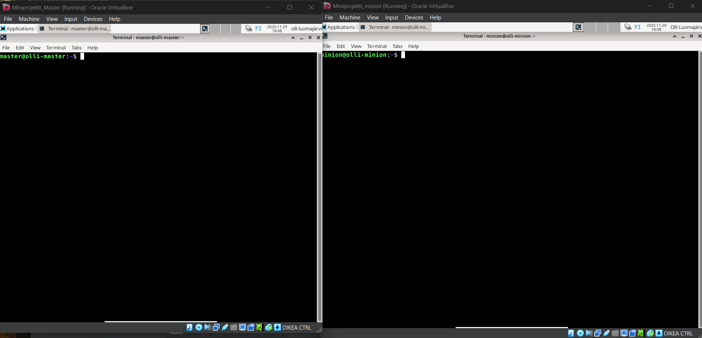
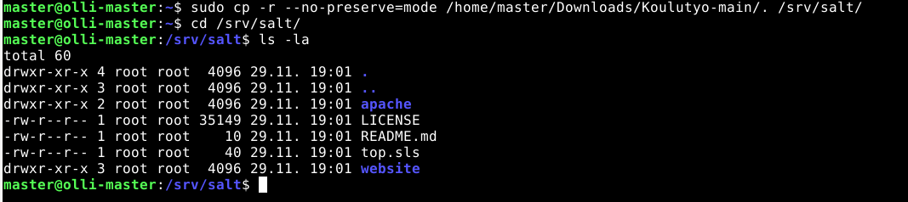

## H6 Miniprojekti

**Projektimme idea:**  Laitamme Saltilla esim. koulun verkkosivu/yksinkertainen HTML-sivu kaikille koneille \
Sisällytämme tähän myös Apache -palvelimen asennuksen ja konfiguraation

Käytämme tähän kannettavaa tietokonetta: \
Lenovon V14 Gen 4 \
16GB RAM \
AMD Ryzen 5 7520U with Radeon Graphics (2.80 GHz) \
Linuxina toimii debian-live-13.1.0-amd64-xfce 

Tehtävän aluksi olimme asentaneet Saltin kahdelle virtuaalikoneelle. 



Ohjeet löytyvät aiemmista tehtävistä https://github.com/OlliLuo/palvelinten-hall/blob/main/h1-viisikko.md ja Tero Karvisen ohjeesta https://terokarvinen.com/install-salt-on-debian-13-trixie/ Toiselle koneista asennettiin salt-master ja toiselle salt-minion. 

Seuraavaksi teimme seuraavat tiedostot:

**top.sls tiedosto** \
Määrittelee, mitkä Salt-tilat ajetaan mille koneille

- apache: Ajaa ensin apache/init.sls

- website: Sitten website/init.sls
```

- base:
  '*':
    - apache
    - website
```

**Apache kansio missä init.sls**

pkg.installed: Asentaa apache2-paketin \
service.running: Varmistaa, että Apache-palvelu on käynnissä
```

apache2:
  pkg.installed

apache2.service:
  service.running:
    - name: apache2
```

**Website kansio missä init.sls** \

file.managed: Lataa tiedoston Salt-masterilta kohdekoneelle 

source: salt://: Etsii tiedoston Saltin tiedostojärjestelmästä 
```

/var/www/html/index.html:
  file.managed:
    - source: salt://website/files/index.html
```
**Website kansioon files-kansio mihin index.html** \
Tähän loimme esimerkkisivun mikä korvaa oletussivun.

  Esimerkkisivu:
  
```

  <!-- /srv/salt/website/files/index.html -->
<!DOCTYPE html>
<html>
<head>
    <title>Koulun Salt-projekti</title>
</head>
<body>
    <h1>Tervetuloa koulun verkkosivulle!</h1>
</body>
</html>
```
Nämä tiedostot löytyvät  github repositorysta https://github.com/OlliLuo/Koulutyo.git \ 
Seuraavaksi ladataan master koneella tämä zip-tiedosto ja puretaan pakkaus. \
Tämän jälkeen masterilla syötetään seuraava komento:
```
sudo cp -r --no-preserve=mode /home/"käyttäjä"/Downloads/Koulutyo-main/. /srv/salt/
```
**Salt** kansio pitää itse luoda. 



